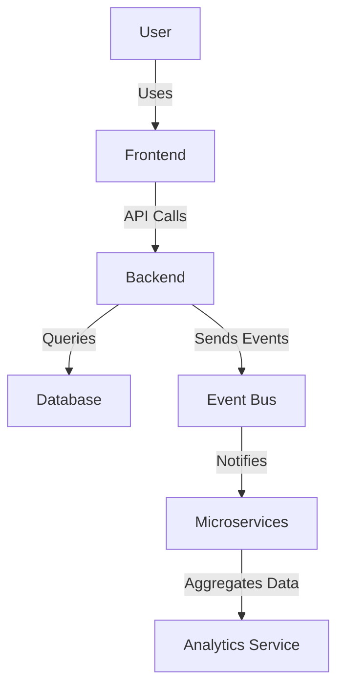

# [EXAMPLE] Architecture Overview

```mermaid
flowchart TD
    A[User] -->|Uses| B[Frontend]
    B -->|API Calls| C[Backend]
    C -->|Queries| D[Database]
    C -->|Sends Events| E[Event Bus]
    E -->|Notifies| F[Microservices]
    F -->|Aggregates Data| G[Analytics Service]
```
