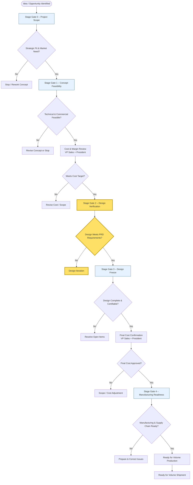

```mermaid
flowchart TD
    A([Idea / Opportunity Identified]) --> SG0[Stage Gate 0 – Project Scope]

    SG0 --> D0{Strategic Fit & Market Need?}
    D0 -- No --> X0[Stop / Rework Concept]
    D0 -- Yes --> SG1[Stage Gate 1 – Concept Feasibility]

    SG1 --> D1{Technical & Commercial Feasible?}
    D1 -- No --> X1[Revise Concept or Stop]
    D1 -- Yes --> CR1[Cost & Margin Review
VP Sales + President]

    CR1 --> D1C{Meets Cost Target?}
    D1C -- No --> X1C[Revise Cost / Scope]
    D1C -- Yes --> SG2[Stage Gate 2 – Design Verification]

    SG2 --> D2{Design Meets PRD Requirements?}
    D2 -- No --> X2[Design Iteration]
    D2 -- Yes --> SG3[Stage Gate 3 – Design Freeze]

    SG3 --> D3{Design Complete & Certifiable?}
    D3 -- No --> X3[Resolve Open Items]
    D3 -- Yes --> CRF[Final Cost Confirmation
VP Sales + President]

    CRF --> D3C{Final Cost Approved?}
    D3C -- No --> X3C[Scope / Cost Adjustment]
    D3C -- Yes --> SG4[Stage Gate 4 – Manufacturing Readiness]

    SG4 --> D4{Manufacturing & Supply Chain Ready?}
    D4 -- No --> X4[Prepare & Correct Issues]
    D4 -- Yes --> RVP[Ready for Volume Production]

    RVP --> RVS[Ready for Volume Shipment]
    %% Current Phase Highlighting (Stage Gate 2 – Design Iteration)
    classDef current fill:#FFE066,stroke:#B38F00,stroke-width:3px;
    classDef gate fill:#E6F2FF,stroke:#1F4E79;

    class SG2,D2,X2 current;
    class SG0,SG1,SG3,SG4 gate;
```